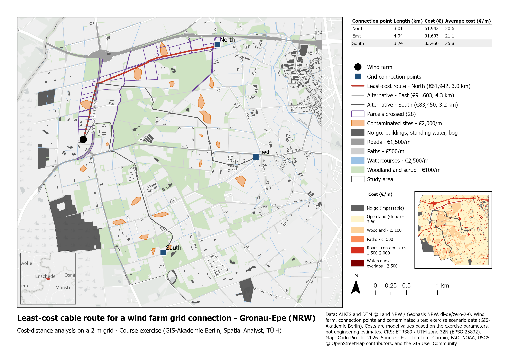

# Least-cost cable route for a wind farm grid connection

**Gronau-Epe, North Rhine-Westphalia · ArcGIS Pro Spatial Analyst · course exercise TÜ 4 “Kabeltrasse”**

*The nearest connection point is not the cheapest.*

| File | Content |
|---|---|
| [TUE4_Kabeltrasse_description.pdf](TUE4_Kabeltrasse_description.pdf) | One-page description: question, data, method, result, limits |
| [TUE4_Kabeltrasse_map.pdf](TUE4_Kabeltrasse_map.pdf) | Map layout (A4, vector) |
| [tue04_cable_route.py](tue04_cable_route.py) | The workflow as an arcpy script |

> Course exercise: the task, the cost parameters and the scenario data were set by GIS-Akademie GmbH. Data preparation, analysis (including the comparison of all three connection points), map and assessment are my own work.

## Question

A planned wind farm near Gronau-Epe must be connected to one of three transformers on the nearest high-voltage line. Where does the cheapest cable route run, what does it cost, and which cadastral parcels does it cross? Because the connection point matters as much as the route, all three points were compared.

## Data

- **DTM** (1 m) and **ALKIS** land use, buildings and 27,584 parcels – Geobasis NRW, [dl-de/zero-2-0](https://www.govdata.de/dl-de/zero-2-0)
- **Scenario data** – wind farm transformer, 3 connection points, 19 contaminated sites – GIS-Akademie (exercise data, not included)

The DTM came in a custom projection equivalent to EPSG:4647 and had already been resampled before delivery. It was reprojected once to EPSG:25832 with bilinear resampling to 2 m cells on an even-metre grid, and used as extent, snap raster and mask throughout.

## Method

- **Additive cost surface (€/m):** slope classes 3 / 4 / 7 / 15 / 50 (0–3°, 3–7°, 7–15°, 15–30°, > 30°), plus woodland and scrub +100, paths +500, roads +1,500, contaminated sites +2,000, watercourses +2,500.
- **Barriers:** buildings, standing water and bog, set to NoData.
- **Routes:** Distance Accumulation from the wind farm, then Optimal Path As Line with path type “each cell” – one route per connection point, each with its path cost.
- **Parcels:** selected by intersection with the cheapest route and summed by their official ALKIS area.

## Result

| Connection point | Route length | Model cost | Mean cost | Straight line |
|---|---|---|---|---|
| **North** | **3.01 km** | **€61,942** | **€20.6/m** | **2.6 km** |
| South | 3.24 km | €83,450 | €25.8/m | 2.2 km |
| East | 4.34 km | €91,603 | €21.1/m | 2.8 km |

The cheapest route leads North and crosses 28 parcels with an official area of 683,853 m² (68.4 ha). The nearest point, South, costs 35 % more. About 85 % of the cost comes from a few crossings, not from length; slope hardly matters (89 % of the area is below 3°).

## Analytical limits

- **Crossing is not following.** Per-metre costs charge a road crossing cell by cell; in practice it is one horizontal drilling at a one-off cost.
- **Realistic for the wrong reason.** For almost a kilometre the route runs alongside the Amtsvennweg, but just outside the €1,500/m road parcel, on private land. Real cables are laid inside the public road parcel, in the verge, precisely because it has a single owner.
- **Parcels are an output, not a cost.** Owners, metres per parcel and easement strips – what matters for land rights – are not modelled.
- **The connection point is not the planner's choice alone.** Under § 8 EEG the default is the suitable point nearest in a straight line – here South – unless another is technically and economically more favourable, and the grid operator may assign a different one.
- **Scope.** Slope at 2 m measures micro-relief; protected areas, utilities, archaeology, soil and grid capacity are not modelled. All costs are model values from the exercise parameters, not engineering estimates.

## About the script

`tue04_cable_route.py` records the workflow as it was run in the ArcGIS Pro GUI, reconstructed from the geoprocessing history (tool calls and parameters as used; paths made relative, the batch run written as a loop, environment settings made explicit). It needs ArcGIS Pro 3.x with Spatial Analyst and 3D Analyst, and the course data, which are not included.

---
Map and analysis: Carlo Piccillo, 2026 · Basemap: Esri, TomTom, Garmin, FAO, NOAA, USGS, © OpenStreetMap contributors, and the GIS User Community
