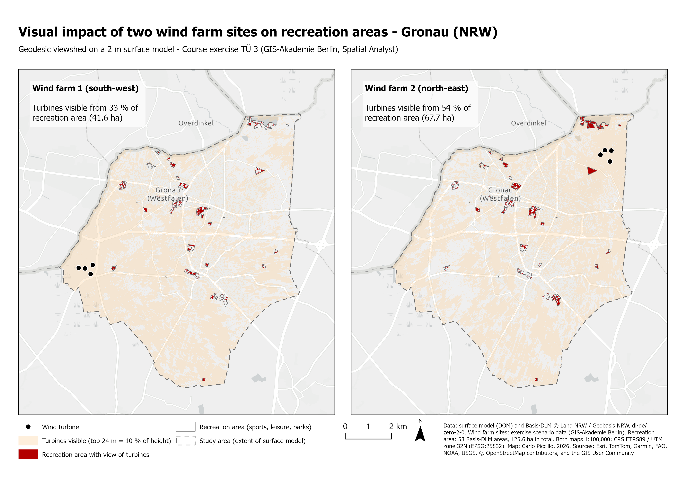

# Visual impact of two wind farm sites on recreation areas

**Gronau, North Rhine-Westphalia · ArcGIS Pro Spatial Analyst · course exercise TÜ 3 “Windparkplanung”**

*Both sites are almost equally visible overall – the ranking comes from where the recreation areas are.*

| File | Content |
|---|---|
| [TUE3_Windparkplanung_description.pdf](TUE3_Windparkplanung_description.pdf) | One-page description: question, data, method, result, limits |
| [TUE3_Windpark_map.pdf](TUE3_Windpark_map.pdf) | Map layout (A4, vector) |

> Course exercise: the task, its parameters and the scenario data were set by GIS-Akademie GmbH. Data checks, analysis, map and assessment are my own work.

## Question

Two sites are under discussion for a wind farm of four turbines near Gronau. Which one affects the view from sports, leisure and recreation areas less? An area counts as affected where at least the top 24 m (10 %) of a 240 m turbine is visible from 1.6 m eye height.

## Data

- **Surface model (DOM)**, 1 m – course data; format matches the Geobasis NRW DOM1 (inferred, no metadata supplied)
- **Basis-DLM** settlement land use, of which 53 sports, leisure and recreation areas (125.6 ha) – Geobasis NRW, [dl-de/zero-2-0](https://www.govdata.de/dl-de/zero-2-0)
- **Scenario data** – 8 turbines at two sites – GIS-Akademie (exercise data, not included)

## Method

- **Threshold as offsets:** 216 m (90 % of 240 m) at each turbine, 1.6 m for the viewer. Sightlines are symmetric, so the turbines act as observers.
- **Geodesic Viewshed** on a 2 m grid, all sightlines. Each turbine is a 150 m line whose two vertices are observers – eight per site.
- **Zonal Statistics as Table** per recreation area (Basis-DLM OBJART 41008): visible cells × 4 m² = area with a view of the turbines.

## Result

| Site | Area with a view | Share of 125.6 ha | Areas affected |
|---|---|---|---|
| **Wind farm 1 (south-west)** | **41.6 ha** | **33 %** | 52 of 53 |
| Wind farm 2 (north-east) | 67.7 ha | 54 % | 53 of 53 |

Wind farm 1 has the smaller impact. Over the whole study area the two sites are almost equally visible (about 46 and 49 km²); the difference comes from several recreation areas close to Wind farm 2, visible almost in full.

## Analytical limits

- **The perimeter decides the answer.** Only recreation areas of the Basis-DLM settlement domain count – no woodland, countryside or paths – and nothing across the Dutch border, right next to Wind farm 1.
- **Visible is not disturbing.** A 24 m blade tip at 10 km counts as much as a full turbine at 1 km.
- **A surface model is not the ground.** Where roofs and tree crowns exist, the viewers stand on top of them.
- **Simplifications:** turbines reduced to two observer points each; a mixed recreation class that includes allotments and holiday-home areas.

The full discussion is in the description PDF.
